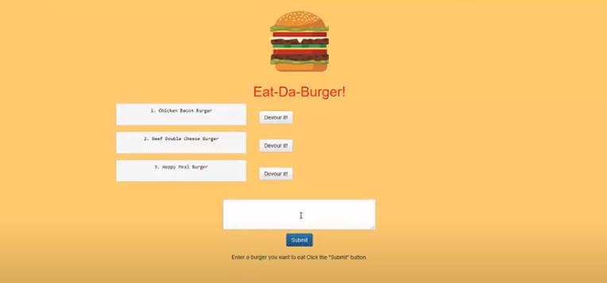

# node-express-burger-app

## Description 

This is a homework requirement for GT Full Stack Flex Program. This node express burger app and webpage is designed to utilize server side rendering using MVC. By using handlebars we were asked to create a directory structure for this homework which was followed exactly as asked. When you open the website, you are able to see burgers pop up. You can then add a burger that you want to eat. It will then put it in the "Burgers To Be Eaten" column, where you can choose to "eat" the burger with the touch of a button and then it will move to the "devoured" column. From there, you can say you are still hungry and it will move the burger back to the "Burgers To Be Eaten" column!

## Table of Contents

* [Installation](#installation)
* [Usage](#usage)
* [Credits](#credits)
* [MIT License](#mit_license)
* [Badges](#badges)
* [Contributing](#contributing)
* [Tests](#tests)

## Installation

* Open up Heroku Webpage and View App

* Copy github repo and clone to local computer

[Link to Github Repo](https://github.com/CrystalWatkins/gt-hw-mvc-burger-app)
 
[Link to Heroku ](https://evening-ravine-28370.herokuapp.com/)

## Usage 

This Node Express file uses best practices for Handlebars and MVC.

[Link to Github Repo](https://github.com/CrystalWatkins/gt-hw-mvc-burger-app).
 
[Link to Video Website](https://evening-ravine-28370.herokuapp.com/).

## Credits

This was a node express app created using mySQL, mySQL Workbench, node express, ORM, handlebars, and file structuring completed as a homework for the Georgia Tech, FullStack Flex Program.

## MIT_License

Copyright (c) [2020] [Crystal Watkins]

Permission is hereby granted, free of charge, to any person obtaining a copy
of this software and associated documentation files (the "Software"), to deal
in the Software without restriction, including without limitation the rights
to use, copy, modify, merge, publish, distribute, sublicense, and/or sell
copies of the Software, and to permit persons to whom the Software is
furnished to do so, subject to the following conditions:

The above copyright notice and this permission notice shall be included in all
copies or substantial portions of the Software.

THE SOFTWARE IS PROVIDED "AS IS", WITHOUT WARRANTY OF ANY KIND, EXPRESS OR
IMPLIED, INCLUDING BUT NOT LIMITED TO THE WARRANTIES OF MERCHANTABILITY,
FITNESS FOR A PARTICULAR PURPOSE AND NONINFRINGEMENT. IN NO EVENT SHALL THE
AUTHORS OR COPYRIGHT HOLDERS BE LIABLE FOR ANY CLAIM, DAMAGES OR OTHER
LIABILITY, WHETHER IN AN ACTION OF CONTRACT, TORT OR OTHERWISE, ARISING FROM,
OUT OF OR IN CONNECTION WITH THE SOFTWARE OR THE USE OR OTHER DEALINGS IN THE
SOFTWARE.

## Badges

## Contributing

Not currently taking any additional contributions at this time.

## Tests

There are no tests for this code.